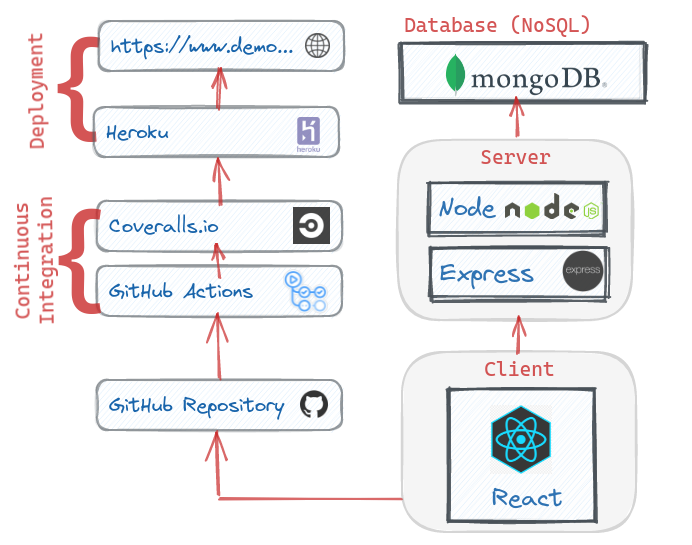
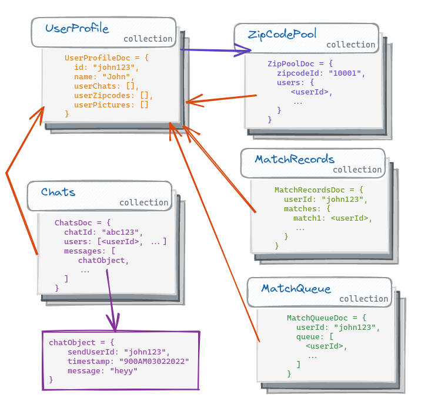

# Woofer &middot; [](https://github.com/spencerlepine/woofer/actions/workflows/main.yml) [](https://coveralls.io/github/spencerlepine/woofer?branch=main)

Dating app for dogs. Customize a dating profile, update preferences, and match/chat with nearby users.

[](https://woofer-demo.herokuapp.com/)

# 🎯 Overview

- Designed a MongoDB atlas NoSQL database managing user profile records, zip code groups, and yes/no match records
- Built real-time chat feature with Socket.io with persistent message history stored in the database.
- Integrated Firebase Authentication to manage user accounts, and verify tokens for the backend API requests.
- Integrated CI/CD pipeline with Git, Jest, GitHub Actions, Docker Hub, and AWS EC2.
- Developed with a ticket system and feature branches, while following schemas and UI designs.

# 🌟 Features

See the [Whitepaper](./WOOFER_WHITEPAPER.pdf).

# 📦 Technologies:

**Front-end:** [React](https://github.com/facebook/react/), [Burma](https://github.com/jgthms/bulma)

**Backend:** [Node](https://nodejs.org/), [Express.js](http://expressjs.com/), [MongoDB](https://docs.mongodb.com/)

**Testing:** [Jest](https://jestjs.io/) , [supertest](https://github.com/visionmedia/supertest), [Testing Library](https://testing-library.com/docs/react-testing-library/intro/), [Puppeteer](https://pptr.dev/), [Coveralls.io](https://coveralls.io/)

**CI/CD:** [Docker](https://docs.docker.com/), [GitHub Actions](https://docs.github.com/en/actions), [AWS EC2](https://aws.amazon.com/ec2/)

**Modules:** [Firebase](https://firebase.google.com/) (Authentication), [Joi](https://github.com/sideway/joi) (Input verification), [Socket.io](https://socket.io/) (Chat API)

# ⚙️ Setup:

#### Prerequisites

- [Firebase](https://firebase.google.com/) project
- [MongoDB Atlas](https://www.mongodb.com/atlas/database) Database

```sh
npm install
# start server/client for development
npm run dev:react
npm run dev:server
# OR build and run with Node
npm run build
npm start
```

### For Docker + Deployment:

#### Prerequisites

- [Docker](https://www.docker.com/) installed locally
- [DockerHub](https://hub.docker.com/) account
- AWS [EC2](https://aws.amazon.com/ec2/) instance running (see [EC2 Setup Walkthrough](./resources/EC2_SETUP_WALKTHROUGH.md))

- Create `.env.development` or `.env.production` file (see [`.env.sample`](./.env.sample))
- update the **GitHub Repository Secrets** (see [EXAMPLE_SECRETS](./resources/EXAMPLE_SECRETS.md))

```sh
# cp .env.development .env.production
docker compose build
docker compose up
```

# 🌐API Schema

See [Endpoint Schema](./resources/WOOFER_API.md).

# 🏗️ Application Architecture



# 🗄Database Design



# 🗃️ Ticket System

- Project Tickets: [Trello Board](https://trello.com/b/tYtdHAT5/woofer-project)

# 🚀 Contributors

- [Spencer Lepine](https://github.com/spencerlepine)
  - 🏠 Blog [spencerlepine.com](https://www.spencerlepine.com)
  - 😺 GitHub [@spencerlepine](https://github.com/spencerlepine)
  - 🐦 Twitter [@spencerlepine](http://twitter.com/spencerlepine)
  - 💼 [LinkedIn](https://www.linkedin.com/in/spencer-lepine)
