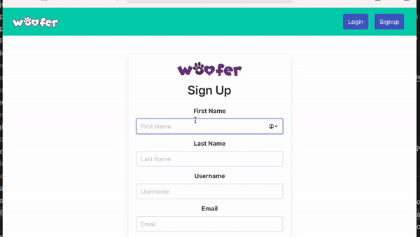

# Woofer

Dating app for dogs with real-time websocket chat and authentication. Customize a dating profile, update preferences, and match/chat with nearby users. A full stack MERN project will full CI/CD pipeline w/ GitHub Actions, Docker Hub, and AWS EC2.

        



## 🎥 Demo Video + Project Walk-through

[](https://www.youtube.com/watch?v=aiJhCoZRc78)

## 🎯 Overview

- Designed a **MongoDB** atlas **NoSQL** database managing user profile records, zip code groups, and yes/no match records
- Built real-time **websocket** chat feature with Socket.io with persistent message history stored in the database.
- Integrated Firebase **Authentication** to manage user accounts, and verify tokens for the backend API requests.
- Integrated **CI/CD pipeline** with Git, Jest, **GitHub Actions**, Docker, and AWS EC2.
- Developed with a ticket system and feature branches, while following schemas and UI designs.

## 📦 Technologies

**Front-end:** [React](https://github.com/facebook/react/), [Bulma](https://github.com/jgthms/bulma)

**Backend:** [Node](https://nodejs.org/), [Express.js](http://expressjs.com/), [MongoDB](https://docs.mongodb.com/)

**Testing:** [Jest](https://jestjs.io/) , [supertest](https://github.com/visionmedia/supertest), [Testing Library](https://testing-library.com/docs/react-testing-library/intro/), [Puppeteer](https://pptr.dev/), [Coveralls.io](https://coveralls.io/)

**CI/CD:** [Docker](https://docs.docker.com/), [GitHub Actions](https://docs.github.com/en/actions), [DockerHub](https://hub.docker.com/), [AWS EC2](https://aws.amazon.com/ec2/)

**Modules:** [Firebase](https://firebase.google.com/) (Authentication), [Socket.io](https://socket.io/) (Chat API)

## 🏗️ Architecture


## 🌟 Features

> Also see the [Whitepaper](./resources/WOOFER_WHITEPAPER.pdf).

### Swipe

View user bio, zodiac sign, age and breed. Scroll the photo carousel and swipe yes/no


### Chat

Engage in real-time chat over websocket with matches (Enabled with Socket.io library)


### Account Login

Create an account and login with email/password authentication (Enabled with Firebase Authentication)


### Preferences

Customize swiping preferences and set the zip code


### Profile

Upload images and customize your profile details


## 🤖 CI/CD Pipeline


## 🗄 Database Design


## 🌐 API Documentation

See [WOOFER_API.md](./resources/WOOFER_API.md) to view the endpoint schema

## 🗃️ Ticket System

Check out the [Trello Scrum Board](https://trello.com/b/tYtdHAT5/woofer-project) used to plan user stories and create tasks during development.


## 🤔 Challenges

Read about learning/challenges of this project in the [Challenges.txt](./resources/challenges.txt) file, or browse [Issue Tickets](https://github.com/spencerlepine/woofer/issues?q=label%3AChallenge+is%3Aclosed+).

## ⚙️ Local Development

> See [SETUP Guide](./resources/WOOFER_SETUP_GUIDE.md).

```sh
cp .env.sample .env
npm install
```

```sh
npm run dev:server
# * Open 2nd terminal *
npm run dev:client
```

## 🌐 Links

- Demo website: (DEPRECATED) [TODO](TODO)
- Demo video: [Youtube video](https://www.youtube.com/watch?v=aiJhCoZRc78)
- Source code: [github.com/spencerlepine/woofer](https://github.com/spencerlepine/woofer)
- Blog post: [https://www.spencerlepine.com/portfolio/woofer](https://www.spencerlepine.com/portfolio/woofer)
