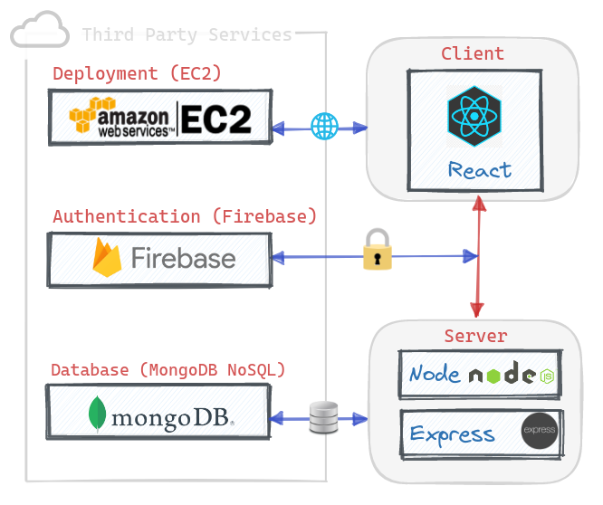

# Woofer &middot; [](https://github.com/spencerlepine/woofer/actions/workflows/production.yml) [](https://codecov.io/gh/spencerlepine/woofer) [](https://github.com/spencerlepine/woofer/actions/workflows/code-analysis.yml)

Dating app for dogs. Customize a dating profile, update preferences, and match/chat with nearby users. View the [DEMO](https://ec2-18-237-220-78.us-west-2.compute.amazonaws.com)

[](https://ec2-18-237-220-78.us-west-2.compute.amazonaws.com)

# 🎯 Overview

- Designed a MongoDB atlas NoSQL database managing user profile records, zip code groups, and yes/no match records
- Built real-time chat feature with Socket.io with persistent message history stored in the database.
- Integrated Firebase Authentication to manage user accounts, and verify tokens for the backend API requests.
- Integrated CI/CD pipeline with Git, Jest, GitHub Actions, Docker, and AWS EC2.
- Developed with a ticket system and feature branches, while following schemas and UI designs.

# 🏗️ Application Architecture



# 🤖 CI/CD Pipeline


# 🌟 Features

See the [Whitepaper](./resources/WOOFER_WHITEPAPER.pdf).

# 📦 Technologies:

**Front-end:** [React](https://github.com/facebook/react/), [Burma](https://github.com/jgthms/bulma)

**Backend:** [Node](https://nodejs.org/), [Express.js](http://expressjs.com/), [MongoDB](https://docs.mongodb.com/)

**Testing:** [Jest](https://jestjs.io/) , [supertest](https://github.com/visionmedia/supertest), [Testing Library](https://testing-library.com/docs/react-testing-library/intro/), [Puppeteer](https://pptr.dev/), [Coveralls.io](https://coveralls.io/)

**CI/CD:** [Docker](https://docs.docker.com/), [GitHub Actions](https://docs.github.com/en/actions), [DockerHub](https://hub.docker.com/), [AWS EC2](https://aws.amazon.com/ec2/)

**Modules:** [Firebase](https://firebase.google.com/) (Authentication), [Socket.io](https://socket.io/) (Chat API)

# ⚙️ Development Setup:

> ### Prerequisites
>
> - [.env](./.env.sample) file (see [`.env.sample`](./.env.sample))
> - [Firebase](https://firebase.google.com/) Project
> - [MongoDB Atlas](https://www.mongodb.com/atlas/database) Database

```sh
cp .env.sample .env && cp .env ./client/.env
npm install
```

```sh
npm run dev:server
```

```sh
# * Open a NEW terminal *
npm run dev:client
```

# 🐳 Run with Docker

> ### Prerequisites
>
> - [Docker](https://www.docker.com/) (installed locally)
> - [DockerHub](https://hub.docker.com/) Account
> - AWS [EC2](https://aws.amazon.com/ec2/) Instance (see [EC2 Setup Walkthrough](./resources/EC2_SETUP_WALKTHROUGH.md))
> - Updated **GitHub Repository Secrets** (see [EXAMPLE_SECRETS](./resources/REPOSITORY_SECRETS.md))

```sh
cp .env.sample .env && cp .env ./client/.env
docker-compose up --build
# visit http://localhost:3000
```

# 🌐API Schema

See [Endpoint Schema](./resources/WOOFER_API.md).

# 🗄 Database Design


# 🗃️ Ticket System

- Project Tickets: [Trello Board](https://trello.com/b/tYtdHAT5/woofer-project)


# 🚀 Contributors

- [Spencer Lepine](https://github.com/spencerlepine)
  - 🏠 Blog [spencerlepine.com](https://www.spencerlepine.com)
  - 😺 GitHub [@spencerlepine](https://github.com/spencerlepine)
  - 🐦 Twitter [@spencerlepine](http://twitter.com/spencerlepine)
  - 💼 [LinkedIn](https://www.linkedin.com/in/spencer-lepine)
